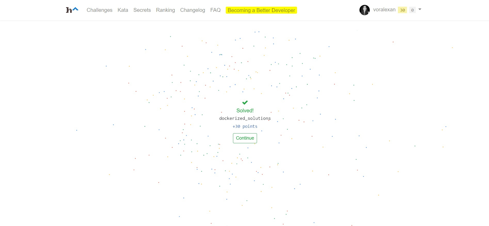

# PFG-test-task
A solution of PFG test task https://hackattic.com/challenges/dockerized_solutions

# Prerequisites
* Python 3.7+
* Docker
* Public Domain Name
* `./certs` directory with your domain certificate and key. Needed for TLS connection to the docker repository
* An access key from https://hackattic.com

# Usage
1. Install python packages:
```bash
pip install -r requirements.txt
```
2. Insert your domain name and access key in the start of the script.

3. Run the script from a directory with ./certs subdirectory.
```bash
python dockerized_solutions.py
```

# Result
You should get something like this =) :


# Sample script output
Sending request to https://hackattic.com/challenges/dockerized_solutions/problem?access_token=<your token>

Initial JSON             =  {'credentials': {'user': 'plain-art@hackattic.com', 'password': 'UQ0UA2ZJAS'}, 'ignition_key': 'IJ23F9FQCW45626S0YFXWKVIH1FZ', 'trigger_token': '0baa37e3.02a4.4b26.8ab3.ad365026fbce'}
Retrieved User ID        = plain-art@hackattic.com
Retrieved Password       = UQ0UA2ZJAS
Retrieved Ignition Key   = IJ23F9FQCW45626S0YFXWKVIH1FZ
Retrieved Trigger Token  = 0baa37e3.02a4.4b26.8ab3.ad365026fbce

Trigger push on https://hackattic.com/_/push/0baa37e3.02a4.4b26.8ab3.ad365026fbcewith data = {registry_host:<your host>}

Retrieved images with the follwong tags =  ['3.26.67', '7.14.633']
Running a container returned :RAAJODwIZnw5Hz1Bfi4dOktaH3seNHE4BUFZRA==

Running a container returned :oops, wrong image!

Received a secret: RAAJODwIZnw5Hz1Bfi4dOktaH3seNHE4BUFZRA==

Sending request with a solution to https://hackattic.com/challenges/dockerized_solutions/solve?access_token=<your token> data {secret:RAAJODwIZnw5Hz1Bfi4dOktaH3seNHE4BUFZRA==}

{"message": "woah there! you've solved this one, no need to convince me more.", "hint": "if you want to refine your solution, pass &playground=1 to disable this warning"}
